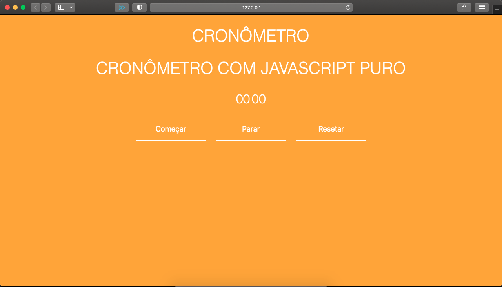
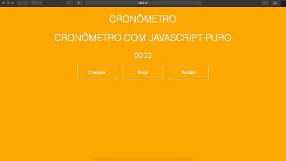

# Cronômetro com JavaScript Puro

  

  

## Description
Um Cronômetro usando JAVASCRIPT HTML e CSS.

Este site foi desenvolvido a nível didático, foi a primeira vez que fiz um site usando essas tecnologias.

## Acesse of site
1. Clique aqui -> [Cronômetro](https://fernandognu.github.io/CronometroJavascript/)

## Getting Started
1. Faça o download ou clone este repositório;
1. Execute o arquivo index.html;

## Do You Wanna Help?
* Abra uma Issue;
* Faça o fork do projeto para sua conta;
